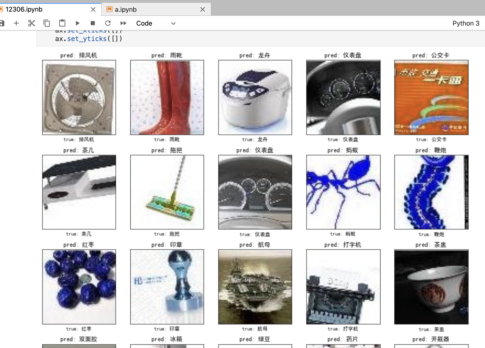
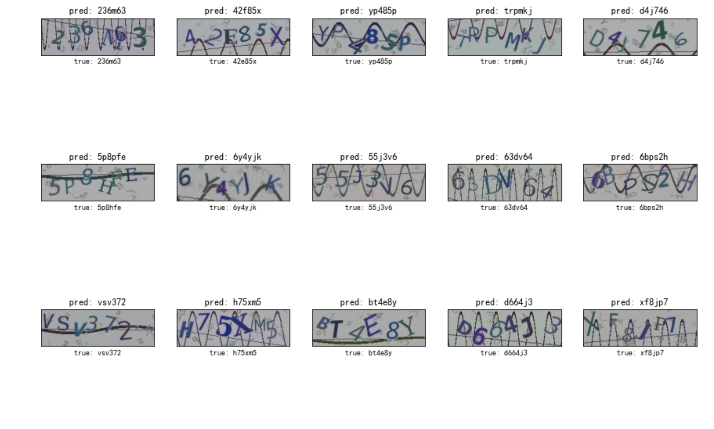

# tensorflow-cnn-captcha-server

## 背景

大家都知道机器学习对识别验证码很好用

但是对于一个爬虫工程师来说,去学习 机器学习相关知识可能成本太高了.(当然有空的话,还是要好好学的)

本篇 是 以实用为主,让你不需要了解任何机器学习的知识,只需要按照配置把图片放好...

就可以解决 验证码问题.

### 前提

需要有标记好的验证码图片

没有的话,假如你现在是接的商用的打码服务,可以把验证通过的图片存下来。

或者自己手工标记一批...(懒的话 对接打码服务也是可以的.)

爬虫来训练这个模型，自己识别验证码收益是非常高的。

假设训练1天后,有95%的准确率来,你就接入自己的服务,并且后续一直把通过的图片保存下来

这样的话...你的样本是越来越多...识别率也就越来越高

## 环境

python版本: 3.7

系统: mac ubuntu 都测试过.

## 安装依赖

`pip install -r requirements.txt`

## opencv 安装

`conda install -c conda-forge opencv`

参考 https://anaconda.org/conda-forge/opencv


## 使用

更改 train/config.py 里面的配置

### DATA_DIR

验证码图片路径（注意,默认验证码图片命名规则是 验证码_xxx.jpg)

也就是说是以`_`分割的, 需要自定义可以修改 `parse_filepath`这个方法

### H, W, C

图片的高、宽、多少层

理论上验证码的图片大小都是一样的...如果有的不一样,就填成自己想要统一成的大小

### str_charts

验证码里的所有字符,或者说验证码由哪些组成（比如全是数字验证码、数字+大小写的验证码）

### D

验证码的长度 （4位验证码,6位验证码等等

### accuracy_rate

到多少准确度以后就停止训练

### model_file_name

训练完后的model文件（api需要用到）

### image_type

图片后缀 比如jpg、png

## 开始训练

`python train/cnn.py`

## 使用api

### 识别验证码

```
def test1():
    "提交验证码图片文件"
    imname = "11216h_3579db1e15a3541dc5b696f6093e1cc4.png"
    files = {"file": open(imname, "rb")}
    r = requests.post("http://127.0.0.1:5000/upload", files=files)
    print(r.json())
```

### 反馈验证结果

```
def test2():
    "提交返回结果"
    reqid = "7537ea4b-b26d-4263-a628-6b02c2d37add"
    status = 1
    r = requests.get(
        "http://127.0.0.1:5000/upload", params={"reqid": reqid, "status": status}
    )
    print(r.json())
```

## 成功截图





## 参考

https://github.com/JackonYang/captcha-tensorflow